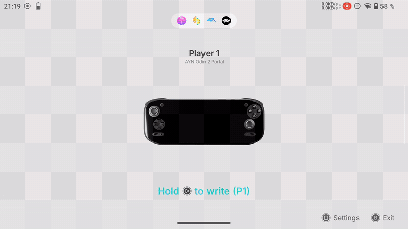
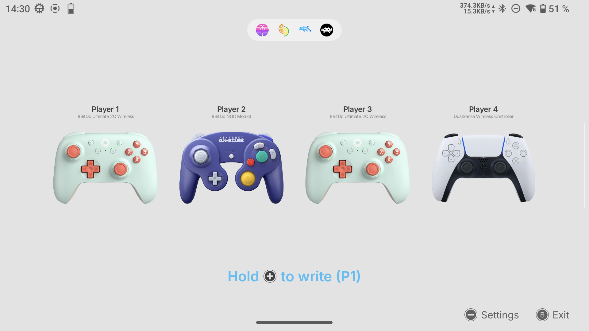
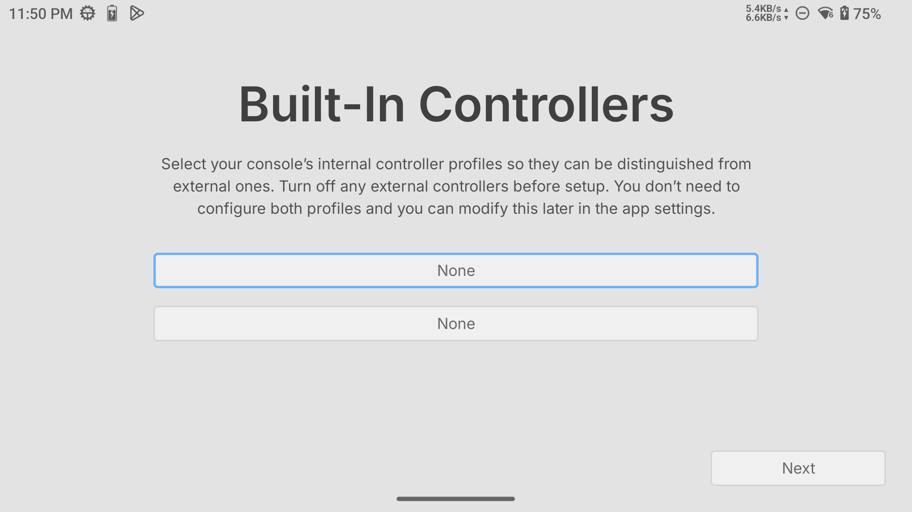
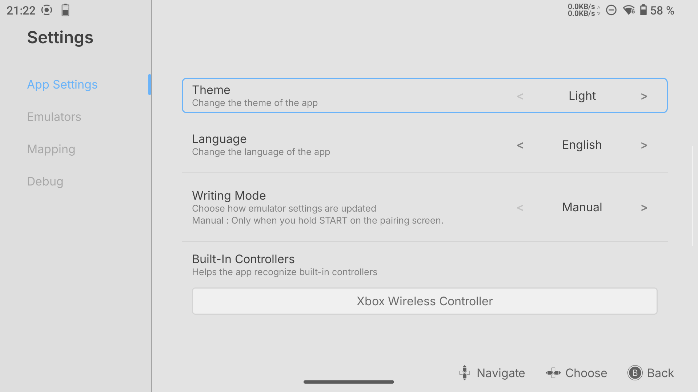
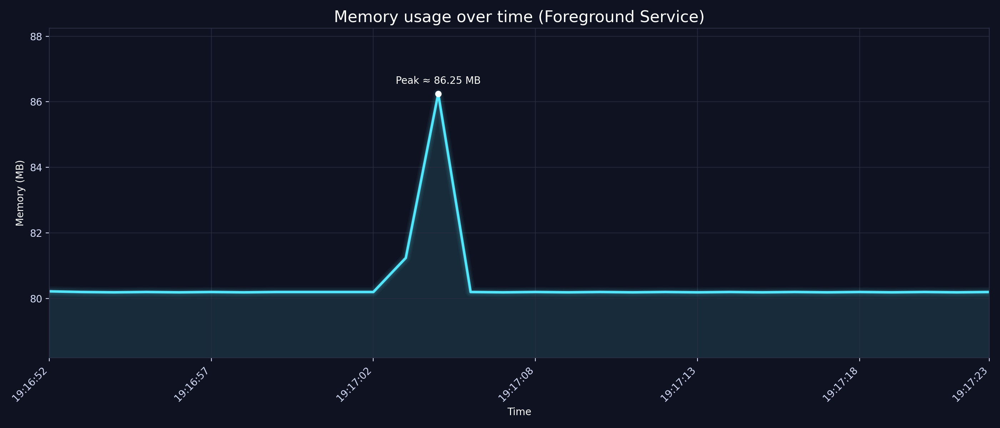

# PairingApp

PairingApp is an Android app designed for Android handheld gaming devices such as Retroid or AYN consoles.

It automatically manages controller assignments for emulators, enabling a seamless handheld ↔ docked experience.
The app is designed for controller-based navigation and does not support touchscreen input.

  

## How It Works

PairingApp detects connected controllers and writes the correct configuration into supported emulator config files.

PairingApp scans connected controllers when the app starts and whenever the controller state changes.

Installed emulators are detected automatically and can be enabled from Settings.

> ℹ️ After the first setup, go to Settings and enable the emulators you want PairingApp to manage.

Controllers are assigned to player slots based on their connection order.

When external controllers are connected, the app switches from built-in controls to external controllers for Player 1, and switches back to built-in controls when all external controllers are disconnected.

This enables a seamless handheld ↔ docked experience.

## Emulator Compatibility

If you want me to test other standalone emulators, feel free to contact me. This list should cover most common use cases.

| Emulator     | Status | Notes                                                                                |
|-------------|--------|--------------------------------------------------------------------------------------|
| Eden        | ✅     | Fully working                                                                        |
| Dolphin     | ✅     | GameCube controls only                                                               |
| RetroArch   | ⚠️     | Works, but player slot assignment is currently bugged                                |
| DuckStation | ❌ | Requires root access to config files. Use Swanstation on RetroArch as an alternative |
| AetherSX2   | ❌     | Requires root access to config files                                                 |
| NetherSX2   | ❌     | Requires root access to config files                                                 |

> ℹ️ For RetroArch, PairingApp uses the priority option to match player order with controller connection order. However, this feature is currently bugged.
> Until it is fixed on RetroArch, you can disable config writing for RetroArch and rely on its built-in auto configuration.

## Important Emulator Behavior

> ⚠️ Emulators must be closed for changes to take effect.

If an emulator is already running, you need to restart it.

This behavior is due to how emulators load their configuration files and cannot be changed by this app.

## First Setup

On first launch, PairingApp needs to identify which controller profile belongs to the built-in controls.

1. Launch the app
2. Select the built-in controller profile (it may appear as "Xbox Wireless Controller" or other names).  
   Note: Select the profile you are using. You do not need to configure multiple profiles.
3. Enable the emulators you want the app to manage in Settings

> ⚠️ Because some Android handheld devices use proxy controller profiles, it is recommended to turn off external controllers before selecting the built-in profile.

You can change the built-in controller profile later in Settings.

## Modes

### Manual Mode

Manual mode gives full control to the user.

You open the app and press **Start** (Player 1 only) when you want to write the controller configuration.

This mode is recommended if you do not want the app running in the background.

### Automatic Mode

Automatic mode works like plug and play.

The app automatically writes the correct configuration whenever the controller state changes:

- controller connected
- controller disconnected
- controller order changed

Automatic mode runs as a foreground service, allowing the app to continuously monitor controller state and update configurations in real time, even when the app is in the background.

Use this mode if you want a fully automated experience without manually triggering configuration updates.

For RAM usage while running in the background, see the RAM usage in the Performance section below.

## Settings

### Theme

Change the app appearance.

### Auto / Manual Mode

Choose whether the app writes configs manually or automatically.

### Built-in Controller

Select the controller profile used by the handheld built-in controls.

### Emulators

Enable or disable config writing for each detected emulator.

Only enabled emulators will be modified. Disabled emulators will not be affected.

### Debug

Enable debug logs when troubleshooting an issue.

## Performance

### RAM Usage During Config Writing

During normal idle usage, the app uses around **80 MB of RAM**.

During config writing, RAM usage can temporarily increase by around **8 MB**, then returns to the normal idle value.

### 24h Memory Test

A 24-hour memory test shows stable RAM usage with no visible memory leak.

## Troubleshooting

### Missing emulator

If an emulator is installed but not detected, please contact me.

This can happen with different package variants, such as:

- x64 builds
- nightly builds
- forks
- custom package names

### Missing controller or console visuals

Some controller or console visuals may be missing.

If this happens, please contact me with the device/controller name.

### Controller mapping issue

The app uses a classic controller layout.

If buttons are incorrectly assigned, please contact me with:

- device name
- controller name
- emulator used
- description of the issue

### Config writing issue

If config writing does not work:

1. Open Settings
2. Enable debug logs
3. Reproduce the issue
4. Send the debug log file  