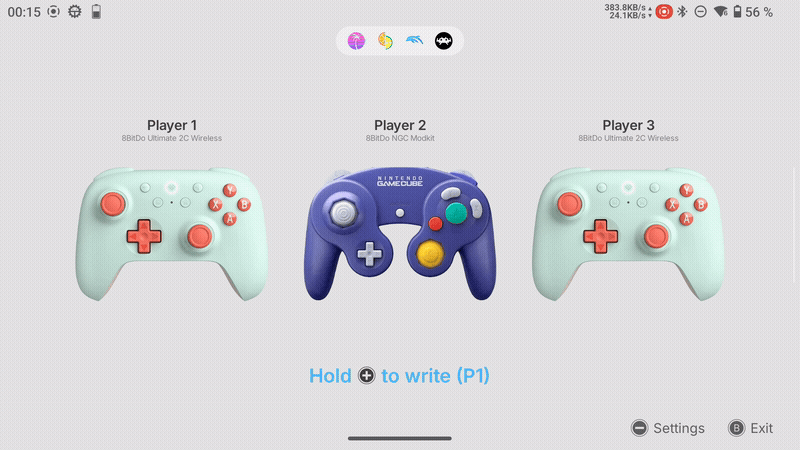
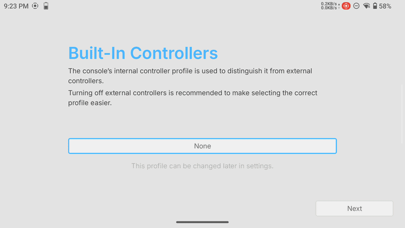
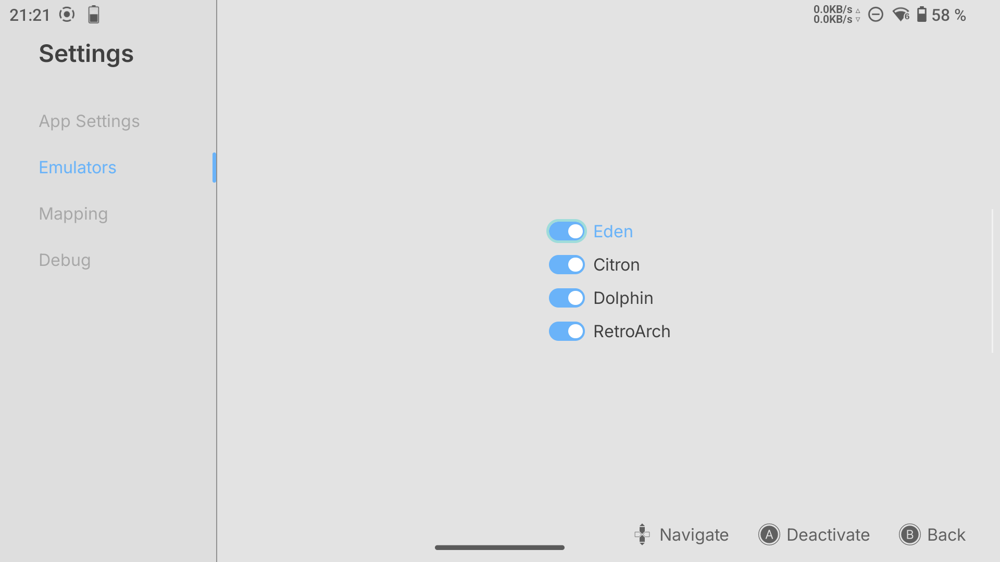
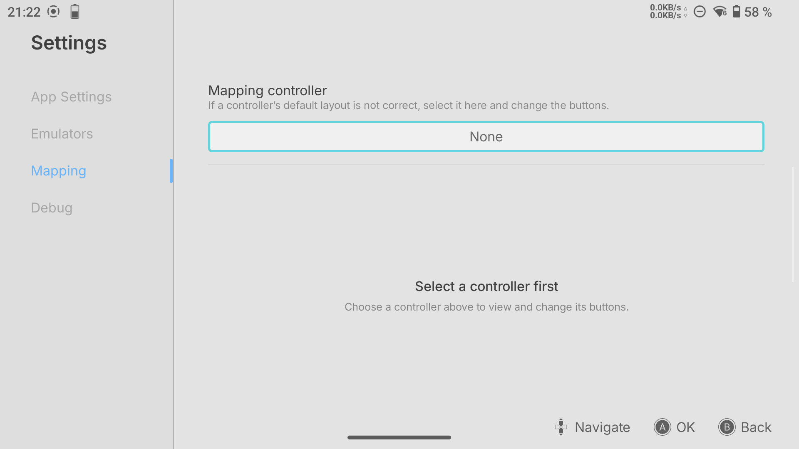
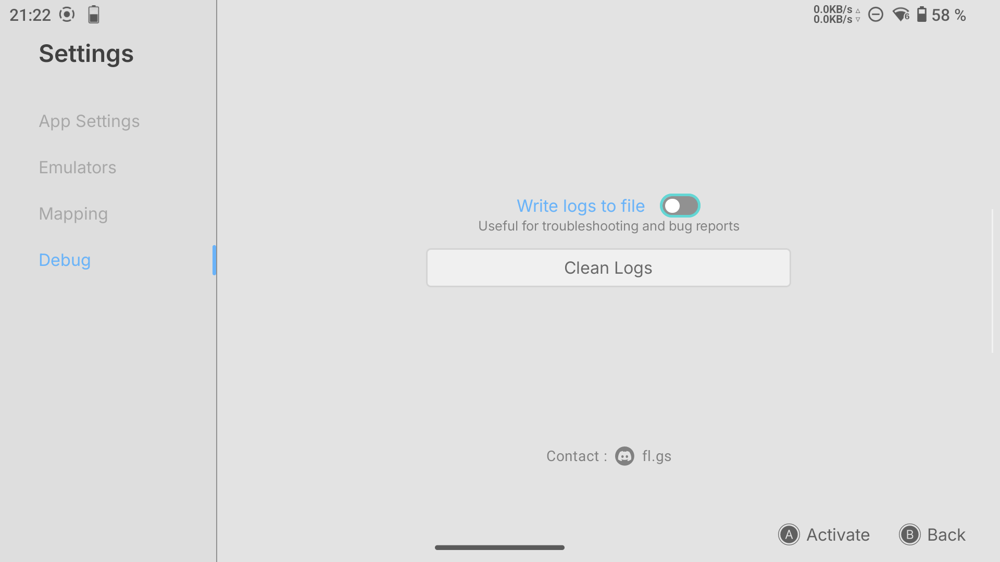

---

# EmuCtrlr

EmuCtrlr is an Android app designed for Android handheld gaming devices such as Retroid or AYN consoles.

It manages controller assignments for emulators, enabling a seamless handheld ↔ docked experience.
The app is designed for controller-based navigation and does not support touchscreen input.

> [!IMPORTANT]
> EmuCtrlr was originally made for personal use.
>
> I started learning Kotlin for this project, and I am still learning. I used LLMs to help with some features that were too challenging for me
> 
> I am currently refactoring it to support more devices, controllers, and emulator setups.
>
> The app may not work correctly on every device or setup yet.
> 
> You can contact me on Discord: **fl.gs**

## Table of Contents

- [How It Works](#how-it-works)
    - [Controller Detection](#controller-detection)
    - [Config Writing](#config-writing)
- [Emulator Compatibility](#emulator-compatibility)
- [First Setup](#first-setup)
- [Mapping](#mapping)
- [Modes](#modes)
    - [Manual Mode](#manual-mode)
    - [Automatic Mode](#automatic-mode)
- [Settings](#settings-preview)
- [Device Images](#device-images)
- [Troubleshooting](#troubleshooting)
- [Optional Setup Guides](#optional-setup-guides)

---

## How It Works

EmuCtrlr works in two steps:

1. It detects the connected controllers.
2. It writes the correct controller order into supported emulator config files.

### Controller Detection

EmuCtrlr scans connected controllers:

- when the app starts
- when a controller is connected
- when a controller is disconnected
- when the controller order changes

Controllers are assigned to player slots based on their connection order.

When external controllers are connected, EmuCtrlr switches Player 1 from the built-in controls to the first external controller.

When all external controllers are disconnected, EmuCtrlr switches Player 1 back to the built-in controls.

### Config Writing

After detecting the controller order, EmuCtrlr can write the updated configuration into enabled emulator config files.

The write behavior depends on the selected mode:

- In **Manual Mode**, open EmuCtrlr and hold **Start** with the controller assigned to **Player 1** to write the controller configuration.
- In **Automatic Mode**, EmuCtrlr writes the configuration automatically whenever the controller state changes.

Only enabled emulators are modified.
Disabled emulators are not affected.

---

## Emulator Compatibility

If you want me to test other standalone emulators, feel free to contact me. This list should cover most common use cases.

| Emulator    | Status | Notes                                                                                 |
|-------------|--------|---------------------------------------------------------------------------------------|
| Eden        | ✅     | Works, but Eden may need to be restarted after changing inputs                        |
| Citron      | ✅     | Works, but Citron may need to be restarted after changing inputs                      |
| Dolphin     | ✅     | GameCube controls only. Wii layouts are user-specific                                |
| RetroArch   | ⚠️     | Works, but player slot assignment is currently bugged                                |
| DuckStation | ❌     | Requires root access to config files. Use SwanStation on RetroArch as an alternative |
| AetherSX2   | ❌     | Requires root access to config files                                                 |
| NetherSX2   | ❌     | Requires root access to config files                                                 |

> [!NOTE]
> **Eden / Citron behavior**
>
> Some launchers, including the default AYN launcher / Android Quickstep, may preload Eden or Citron in the background before you explicitly open them.
>
> When this happens, the emulator process may have already loaded its controller layout into memory before EmuCtrlr writes the updated controller mappings. As a result, the next game launch may still use the previous controller configuration.
>
> Fully restarting the emulator fixes the issue, because it reloads the config file on a fresh start.
>
> This behavior is caused by how the emulator loads its configuration, and cannot be fixed directly from EmuCtrlr.
> However, it may change in future emulator versions if their config loading behavior changes..
>
> ES-DE tends to avoid this issue, as long as you do not return to the Android home / Quickstep.
> 
> **RetroArch**
> 
> EmuCtrlr uses the priority option to match player order with controller connection order.
> However, this RetroArch feature is currently bugged.
>
> As a result, EmuCtrlr does not apply any special workaround for RetroArch.

---

## First Setup

On first launch, EmuCtrlr needs to identify which controller profile belongs to the handheld built-in controls.

1. Launch the app.
2. Select the built-in controller profile. It may appear as "Xbox Wireless Controller" or another name.
3. Enable the emulators you want EmuCtrlr to manage.

> [!IMPORTANT]
> Because some Android handheld devices use proxy controller profiles, it is recommended to turn off external controllers before selecting the built-in profile.

---
## Mapping

The Mapping section lets you customize the button layout for a specific controller.

If the default Xbox-style layout does not match your controller, you can select the controller and manually change its button assignments.

EmuCtrlr will then use this custom layout when writing emulator configurations in the future.

I plan to add predefined layouts for controllers in the future, but this requires knowing whether each controller uses an Xbox-style, Nintendo-style, or custom layout.

---

## Modes
You can change the config writing mode from the app Settings.
### Manual Mode

Manual mode gives full control to the user.

You open the app and press **Start** (Player 1 only) when you want to write the controller configuration.

This mode is recommended if you do not want the app running in the background.

### Automatic Mode

Automatic mode works like plug and play.

The app automatically writes the correct configuration whenever the controller state changes:

- controller connected
- controller disconnected
- controller order changed

Automatic mode runs as a foreground service, allowing the app to continuously monitor controller state and update configurations in real time, even when the app is in the background.

Use this mode if you want a fully automated experience without manually triggering configuration updates.

---

## Settings preview

---

## Device Images

EmuCtrlr includes built-in images for several handheld consoles and controllers.

Images are based on the device or controller model, and may not match the exact color of your own device.

The full list of included device images is available here:

[Device Images](./DEVICE_IMAGES.md)

If your device or controller is not listed, EmuCtrlr will use a placeholder image instead.
> [!NOTE]
> New device images will be added over time with your help.
>
>If your console or controller is not shown correctly in the app, please contact me with the name displayed by EmuCtrlr.

Support for adding or replacing custom images is planned for a future update.

---

## Troubleshooting

### Missing emulator

If an emulator is installed but not detected, please contact me.

This can happen with different package variants, such as:

- x64 builds
- nightly builds
- forks
- custom package names

### Config writing issue

If config writing does not work:

1. Open Settings
2. Enable debug logs
3. Reproduce the issue
4. Send the debug log file  

---

## Optional Setup Guides

These guides are optional, but can help improve the handheld ↔ docked experience.

- [ES-DE setup](./SETUP_ES_DE.md)  
  How to add EmuCtrlr as an Android app inside ES-DE.

- [Key Mapper setup](./SETUP_KEY_MAPPER.md)  
  How to create a controller shortcut to exit or return from a running game.