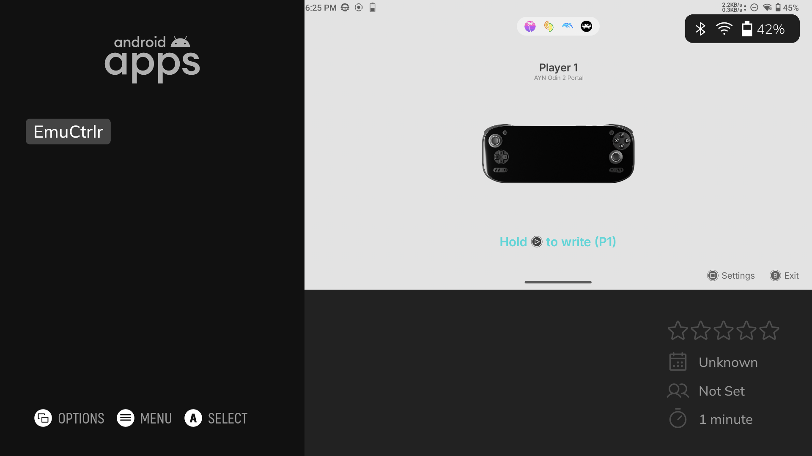

# ES-DE Setup

This guide explains how to add EmuCtrlr as an Android app inside ES-DE.

This is optional, but useful if you use ES-DE as your main frontend and want to launch EmuCtrlr directly from it.

---

## Add EmuCtrlr to ES-DE

1. Open **ES-DE**.
2. Press **Start** to open the main menu.
3. Go to **Utilities**.
4. Open **Game Importer**:
    - Set **Import to system** to **Android Apps**.
    - Set **Remove entries** to **Never**.
    - Enable **Import Media**.
    - Enable **Import Banners or Logos if available**
    - Enable **Overite Media Files**
5. Start the importer.
6. In the app list, select **EmuCtrlr**.
7. Select **Import**.

EmuCtrlr should now appear in the **Android Apps** section of ES-DE.

