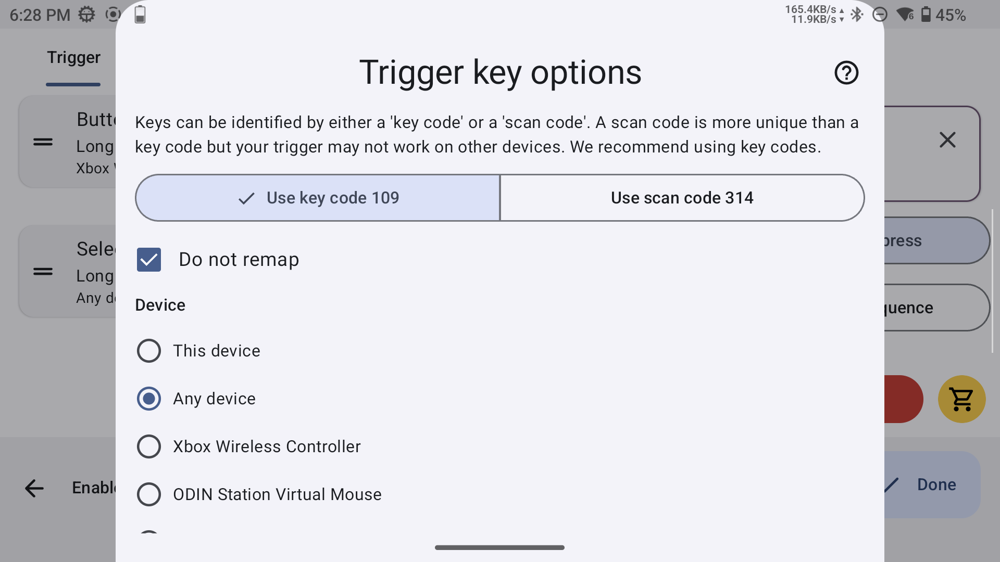
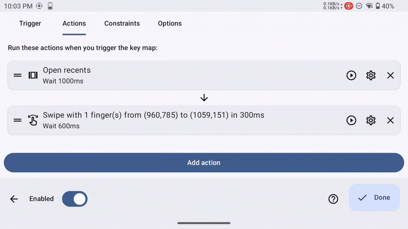

# Key Mapper Setup

This guide explains how to create a controller shortcut with Key Mapper to close a running game from the Android recent apps screen.

This is optional, but useful if you want to return to ES-DE, your launcher, or your frontend directly from your controller.

Shoutout to **FrankieT** for the Key Mapper setup: https://www.youtube.com/watch?v=mLt_Lv9v_gM

---

## What this shortcut does

The shortcut manually reproduces the Android gesture:

1. Open recent apps
2. Swipe the current game away
3. Tap the screen to return to the previous app, launcher, or frontend

---

## Requirements

Install **Key Mapper** on your Android device:

https://play.google.com/store/apps/details?id=io.github.sds100.keymapper&hl=fr

You also need a screenshot of the **Recent apps** screen to help define the swipe and tap positions.

Example:

---

## Create the shortcut

1. Open **Key Mapper**.
2. Tap **Create a new key map**.
3. Tap **Tap to record trigger**, then press the button combination you want to use.
   Use a combination you normally never use in game.
4. Make sure the button order is correct.
   For example, if you want Select + B, Select must be at the top of the list.
5. Change the trigger type from Short press to Long press.
6. Tap the gear icon next to each trigger, then enable:
   - Do not remap
   - Any device

---

## Action 1 — Open recent apps

Switch to the **Actions** tab.

1. Tap **Add action**.
2. Search for **Open Recents**.
3. Select the gear icon for this action.
4. Set the delay to 1000 ms.

---

## Action 2 — Swipe screen

This action swipes the current game away from the recent apps screen.

1. Tap **Add action**.
2. Search for **Swipe screen**.
3. Set Swipe duration to 300 ms.
4. Tap **Select screenshot** and select your screenshot.
5. Tap somewhere near the bottom of the screenshot to set the start position.
6. Change Start to End.
7. Tap somewhere near the top of the screenshot to set the end position.
8. Select the gear icon for this action.
9. Set the delay to 600 ms.

---

## Action 3 — Tap screen

This action simulates a screen tap to return to the previous app from the recent apps screen.

1. Tap **Add action**.
2. Search for **Tap screen**.
3. Tap **Select screenshot** and select your screenshot.
4. Tap somewhere in the middle of the screenshot.

---

## Troubleshooting

### The shortcut does nothing

Make sure the Key Mapper accessibility service is enabled.

Also check that battery optimization is disabled for Key Mapper.

Make sure the triggers are set in the correct order, and that **Do not remap** is enabled.

---

### Recent apps opens, but the game is not closed

Adjust the swipe coordinates.

The swipe must start on the game card and move far enough to dismiss it, like when you swipe it manually.

You can also remove the Tap screen action, try again, and check if the game is dismissed correctly. If it works, adjust the delay on the Swipe screen action, then add the Tap screen action again.

---

### The game closes, but it does not return to the previous app

Increase the delay on the Swipe screen action.
